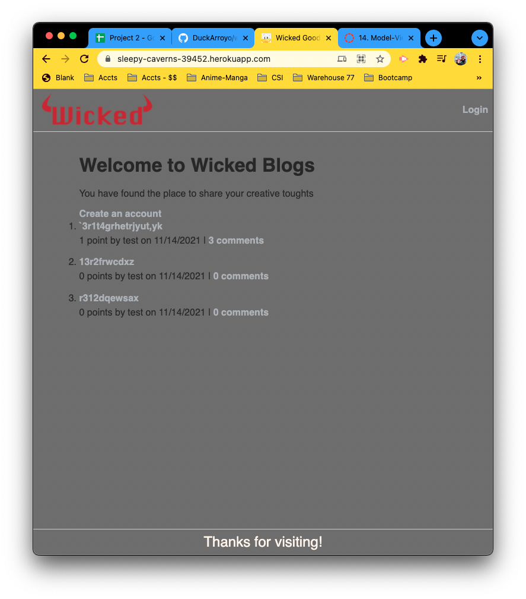
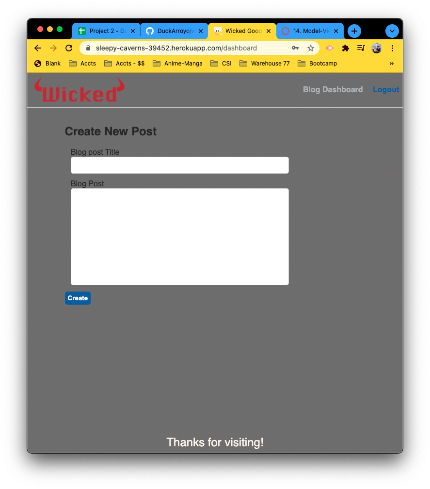
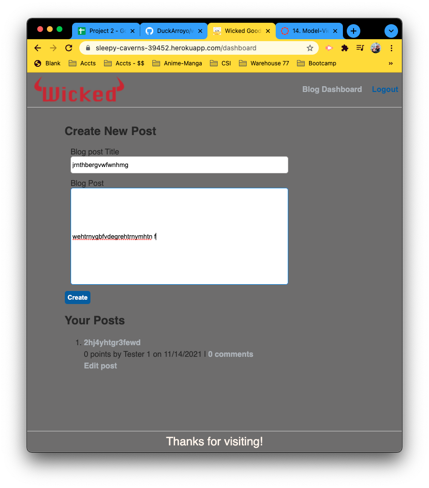
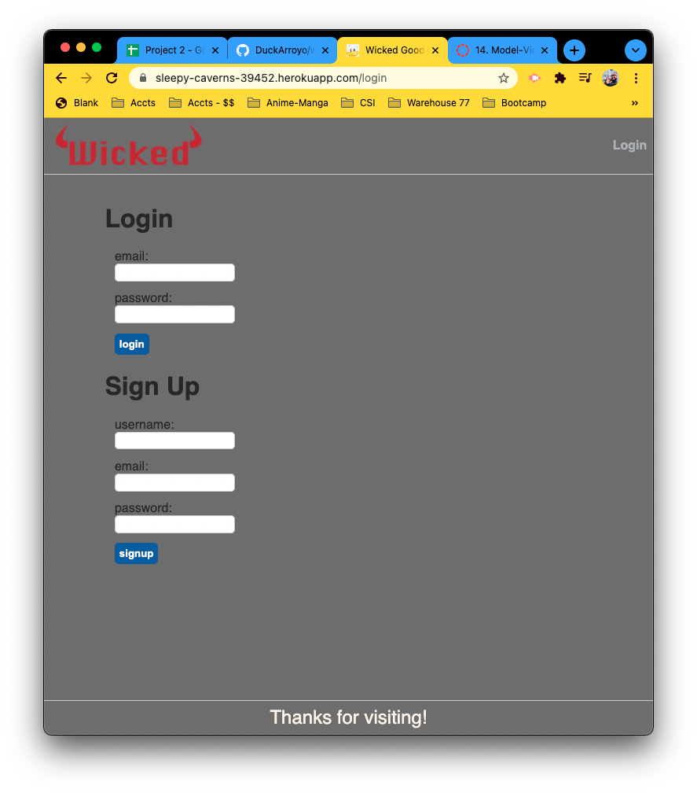
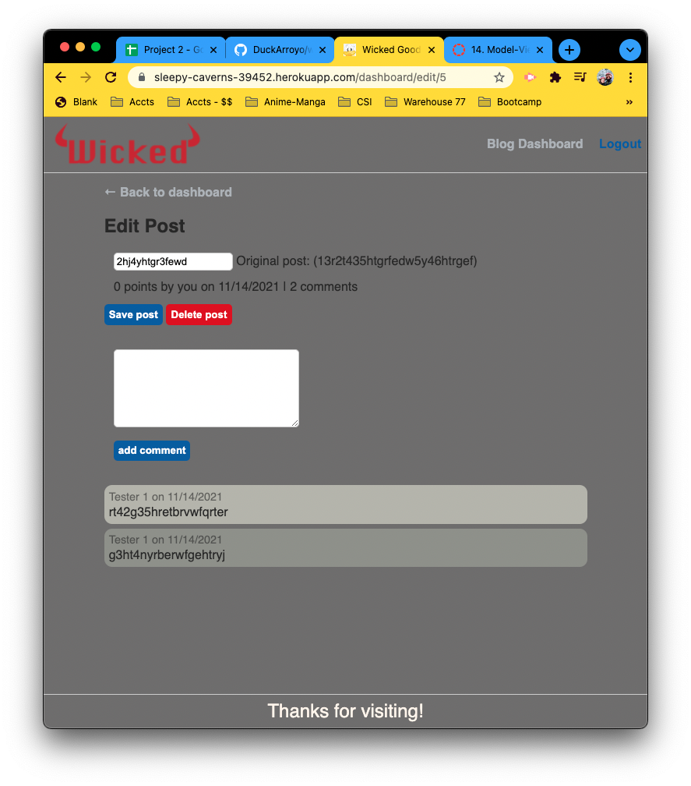
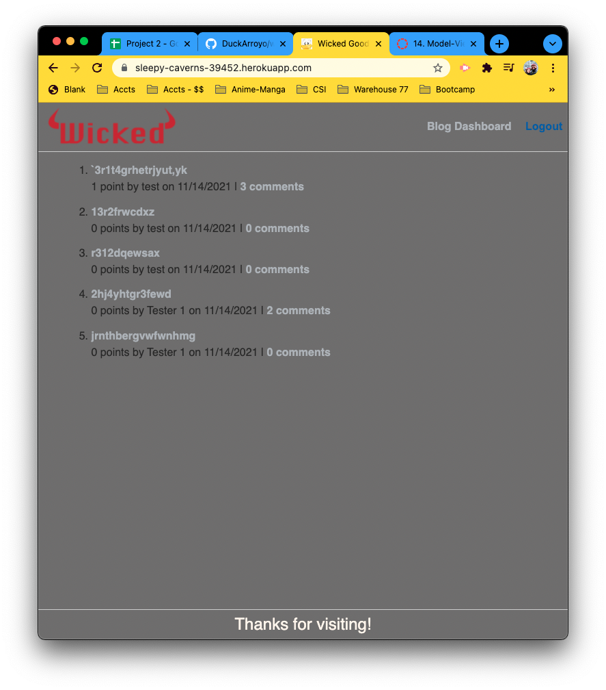

# wickedblogs 

## UO Coding bootcamp Challenge

UO Coding bootcamp Challenge 14

## Links

[Github Repository](HTTPS://github.com/DuckArroyo/wickedblogs)

[Heroku](https://sleepy-caverns-39452.herokuapp.com/)

## Description

Blog application

## Required installations for code duplication

npm

- npm init

express
sequelize
mysql2

- npm install express sequelize mysql2

.env

- npm install dotenv

bcrypt

- npm install bcrypt

Express Handlebars

- npm install express-handlebars

express-sessions and connect-session-sequelize

- npm i express-session connect-session-sequelize

## Run server

npm start or node server

## The commandments

"scripts": {
"watch": "nodemon server.js",
"test": "jest",
"start": "node server.js",
"seed": "node seeds/index.js"
},

# Contributions by:

DeveloperDuckArroyo

[Email](mailto:DeveloperDuckArroyo@gmail.com)

[Portfolio](https://github.com/DuckArroyo/portfolio)

[React Portfolio](http://DuckArroyo.github.io/reactPortfolio)

[GitHub](https://github.com/DuckArroyo)

[Twitter @DevDuckArroyo](https://twitter.com/DevDuckArroyo)

[LinkedIn](https://www.linkedin.com/in/duckarroyo)

[CodePen](https://codepen.io/DeveloperDuckArroyo)

# Screnshots

